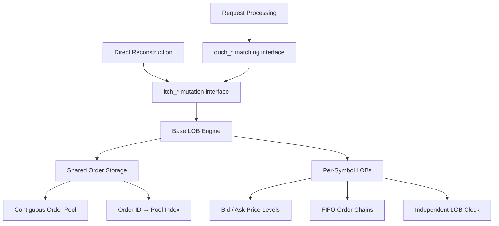
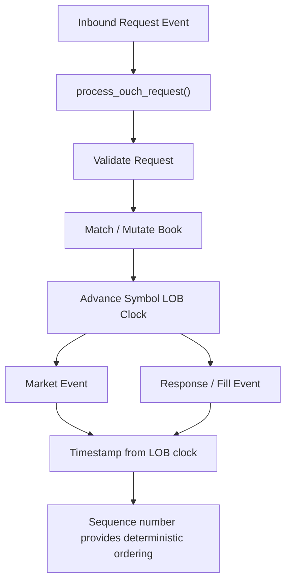
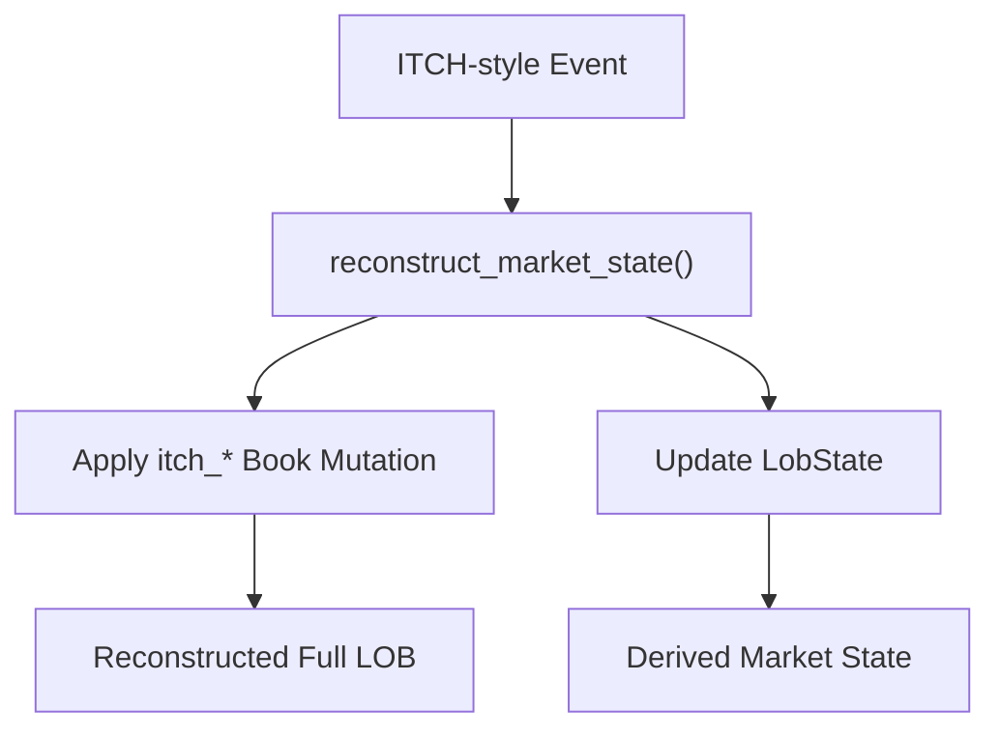

# Base LOB Engine

A shared C++ limit order book engine for market-data reconstruction and event-driven market simulation.

Base LOB Engine maintains order-level books for many symbols within a single engine using pooled order storage, direct order-ID lookup, ordered price-level maps, and FIFO queues within each level.

The same underlying book representation supports two primary workflows:

- direct reconstruction of observed limit order book updates;
- request processing and price-time-priority matching for simulation.

The engine is intentionally kept independent of feed decoding, network protocols, agent logic, and research output pipelines so that the same book implementation can be reused across those systems.

## Architecture



Orders are stored once in a shared pool. Individual LOBs maintain ordered price levels whose FIFO queues reference orders by pool index.

The direct reconstruction interface applies already-observed book changes to this representation. The matching interface operates one level above it: it validates requests, performs matching, advances the corresponding symbol's processing clock, and uses the same underlying book mutation operations while producing resulting events.

## Implementation

### Order Storage

Orders are stored in a preallocated contiguous pool:

```cpp
struct Order {
    int32_t next = INVALID_INDEX;
    int32_t prev = INVALID_INDEX;
    uint32_t price = 0;
    uint32_t shares = 0;
    uint64_t order_id;
};
```

Each order uses pool indices for `next` and `prev` rather than owning pointers or separately allocated list nodes.

A global lookup maps an order ID directly to its position in the pool:

```cpp
boost::unordered_flat_map<uint64_t, uint32_t> orders_by_id;
```

Released positions are returned to a free-index stack and reused by later orders.

This gives the engine three central storage structures:

```text
orders_by_id
    │
    │  order_id → pool index
    ▼
Order Pool
    │
    │  next / prev indices
    ▼
Price-Level FIFO Chains
```

No complete `Order` object is stored inside the price-level maps.

### Price Levels

Each populated price is represented by a compact level:

```cpp
struct level {
    int32_t head = INVALID_INDEX;
    int32_t tail = INVALID_INDEX;
    uint32_t order_count = 0;
    uint32_t total_volume = 0;
};
```

The price itself is the map key, so it is not duplicated inside the level.

A price level references the first and last orders of its FIFO chain:

```text
Price Level
┌──────────────────────┐
│ head                  │
│ tail                  │
│ order_count           │
│ total_volume          │
└──────────┬───────────┘
           │
           ▼
       pool[i]
           │ next
           ▼
       pool[j]
           │ next
           ▼
       pool[k]
```

Insertion appends to the tail of the level. Removal reconnects the neighbouring pool entries. Empty levels are removed from the corresponding side of the book.

This preserves price-time priority without requiring a separately allocated container for every price-level queue.

### Bid and Ask Maps

Each `LOB` currently stores its active price levels using C++23 `std::flat_map`:

```cpp
std::flat_map<uint32_t, level, std::greater<uint32_t>> bid_map;
std::flat_map<uint32_t, level, std::less<uint32_t>> ask_map;
```

Bids are maintained in descending price order and asks in ascending order, leaving the best available level at `begin()` on either side.

The maps reserve capacity for the configured number of price levels during LOB construction.

`std::flat_map` is a practical baseline for the shared engine rather than an assumption that one price-level representation is optimal for every workload. Its contiguous storage provides useful locality when the number of active levels remains manageable, while insertion and removal can become increasingly expensive as the number of populated levels grows.

Alternative price-level representations can therefore be evaluated independently as the engine is benchmarked across different reconstruction and simulation workloads.

## Multi-Symbol Books

An `Engine` owns an array of LOBs:

```cpp
std::unique_ptr<LOB[]> books;
```

The current configuration supports up to:

```cpp
constexpr size_t MAX_TICKERS = 10000;
```

and a `stock_locate` identifies the book associated with an operation.

The engine is therefore designed to maintain many symbols simultaneously rather than requiring a separate engine object for every instrument.

The current storage configuration also preallocates:

```cpp
constexpr size_t ORDER_POOL_SIZE = 10000000;
constexpr size_t ORDER_ID_MAP_SIZE = 10000000;
constexpr size_t MAX_LEVELS = 2000;
```

The resulting memory footprint is intentionally substantial. The design trades fixed upfront storage for reusable pool indices and reduced allocation activity during reconstruction and matching.

Exact memory consumption depends on compiler, standard-library implementation, container occupancy, configured capacities, and the underlying `flat_map` implementation.

## Interfaces

The engine exposes two different levels of operation over the same underlying book representation.

### Direct Reconstruction — `itch_*`

The reconstruction interface directly applies an already-observed change to the LOB:

```cpp
itch_add_order(...)
itch_execute_order(...)
itch_reduce_order(...)
itch_delete_order(...)
itch_replace_order(...)
```

These operations are suitable for market-data decoders, historical replay, reconstructed market views, and similar systems where the event being processed already describes what happened to the book.

For example, an add message can be translated directly into:

```cpp
engine.itch_add_order(
    stock_locate,
    order_id,
    price,
    shares,
    side
);
```

There is no matching decision to make: the observed event itself defines the required mutation.

Direct reconstruction assumes an ordered and internally consistent input stream. The current low-level mutation interface contains limited defensive handling and should not be treated as a malformed-feed validation or recovery layer.

### Request Processing and Matching — `ouch_*`

The matching interface processes requests rather than replaying known book outcomes.

Its main entry point is:

```cpp
process_ouch_request(
    Event& event,
    std::deque<Event>& feed,
    uint64_t& seq_num
);
```

The request path handles:

- new orders;
- cancellations;
- replacements;
- request validation;
- price-time-priority matching;
- partial and complete fills;
- passive order insertion;
- market-order exhaustion;
- generation of resulting market and response events.

Invalid requests are handled at this layer. For example, duplicate order IDs, invalid prices, missing cancellation targets, and invalid replacement requests can produce rejection events rather than being interpreted as direct book mutations.

The matching implementation reuses the same low-level mutation operations used by reconstruction. Functions such as `itch_add_order()`, `itch_reduce_order()`, `itch_delete_order()`, and `itch_replace_order()` therefore also act as the underlying book mutation primitives used internally by the matching path.

### Interface Naming

The `itch_*` and `ouch_*` prefixes distinguish two operation semantics:

```text
itch_*    observed book mutation
ouch_*    request processing / matching
```

The names follow the roles these operations commonly have in exchange protocols, but they do **not** restrict the engine to NASDAQ ITCH or OUCH.

A decoder for another market-data protocol can translate equivalent order-level updates into the reconstruction interface. Likewise, a simulation or exchange model can construct the corresponding request events without originating from a literal OUCH network feed.

## Matching-Time Model

The simulation-facing matching path includes a simple configurable processing-time model:

```cpp
constexpr uint64_t PT_BASE       = 5000;
constexpr uint64_t PT_ORDER_FILL = 10;
constexpr uint64_t PT_LEVEL_WALK = 100;
constexpr uint64_t PT_ADD_ORDER  = 250;
constexpr uint64_t PT_CANCEL     = 100;
```

These values are applied to the clock of the LOB being processed.

They are model parameters rather than measured exchange latency guarantees and can be changed for the simulation being constructed.

### Per-Symbol Processing Clocks

Every LOB maintains its own clock:

```cpp
uint64_t clock = 0;
```

When a request reaches the matching engine, the corresponding book first advances to the request timestamp when necessary:

```cpp
if (event.timestamp > lob.clock) {
    lob.clock = event.timestamp;
}
```

Processing costs are then accumulated on that book's clock.

Conceptually:

```text
Engine
│
├── LOB[symbol A] ── clock
├── LOB[symbol B] ── clock
├── LOB[symbol C] ── clock
└── ...
```

This avoids introducing an artificial global processing dependency between unrelated symbols. Work performed while processing one symbol does not automatically advance the processing state of every other symbol.

The model therefore provides a basis for representing independently progressing symbol-level matching paths within the same event-driven simulation.

### Event Time and Sequence

Events produced by matching use the resulting LOB clock as their timestamp and an externally maintained sequence counter for deterministic ordering.

For example:

```cpp
Event{
    lob.clock,
    seq_num++,
    event.sequence_num,
    ...
};
```

These fields represent different concepts:

- `timestamp` records modeled processing time;
- `sequence_num` establishes a deterministic order between generated events;
- `causal_parent_id` links a generated event to the request that caused it.

A single request may generate several events at the same modeled timestamp. Sequence numbering keeps those events distinct and deterministically ordered without requiring artificial timestamp increments.

The sequence counter is intentionally supplied by the caller rather than maintained as global state inside Base LOB Engine.

## Matching Flow



Matching walks the best opposite-side price level first and consumes resting orders in FIFO order.

When an aggressive order exhausts a level and remains marketable against the next level, the configured level-walk processing cost is applied before matching continues.

Any unfilled quantity from a limit order rests in the book. Remaining quantity from a market order is rejected once the available opposite book is exhausted.

## Engine Modes

The engine type includes an explicit mode:

```cpp
enum class EngineMode : uint8_t {
    Simulation = 0,
    Parser = 1
};
```

which allows instances to be declared as:

```cpp
Engine<EngineMode::Simulation> exchange_engine;
Engine<EngineMode::Parser> market_view;
```

At present, `EngineMode` is primarily an architectural type distinction. The two modes share the same fundamental storage representation and most of the same engine implementation.

The distinction exists to make the intended role of an engine instance explicit.

This becomes useful in systems where multiple LOB representations coexist. For example, an event-driven simulation may contain an exchange-side matching engine while a separate parser-mode engine reconstructs the market view available elsewhere in the simulation.

Making those roles visible in the type encourages the caller to distinguish between the authoritative matching state and a reconstructed view instead of treating every `Engine` instance as interchangeable.

The template also leaves room for mode-specific implementation differences in future versions without requiring separate LOB implementations.

## Event Representation

`events.h` defines the common event representation used by the simulation-facing interfaces.

The event envelope contains:

```cpp
struct Event {
    uint64_t timestamp;
    uint64_t sequence_num;
    uint64_t causal_parent_id;

    EventType event_type;
    MsgType msg_type;

    uint16_t stock_locate;

    payload p;
};
```

The payload union contains the message-specific data for inbound order requests, reconstructed market events, matching responses, fills, cancellations, replacements, and other simulation events.

This provides a common representation through which the matching engine can consume requests and emit their resulting events while preserving timestamp, ordering, and causal metadata.

Feed decoders using the direct `itch_*` interface do not need to construct `Event` objects.

## Market State Reconstruction

Each `LOB` also contains a lightweight derived state:

```cpp
LOB::LobState state;
```

which currently tracks information including:

- best bid and ask;
- previous best bid and ask;
- midpoint;
- spread;
- last trade price and size;
- executed volume;
- bid- and ask-side executed shares;
- aggregate resting buy and sell shares;
- order imbalance;
- LOB timestamp.

`market_state.h` provides:

```cpp
reconstruct_market_state(engine, event);
```

for event-based reconstruction where both the full order book and these derived fields should be maintained together.

Its role is:



This is useful when a reconstructed market view requires both order-level state and immediately available market features.

`reconstruct_market_state()` is itself a reconstruction path. It is **not** a feature-only update function.

It calls the underlying `itch_*` operations and therefore mutates the order pool and price-level books in addition to updating `LobState`. It should not be called on an exchange matching-engine instance merely to calculate features after that engine has already processed the same event, since doing so would apply the book mutation a second time.

Users that only require direct book reconstruction can use the `itch_*` interface without `LobState` reconstruction.

## Price Representation and Tick Size

Prices are represented as integers.

The default LOB tick size is:

```cpp
uint64_t TICK_SIZE = 100;
```

corresponding to a `0.01` tick when prices use four decimal digits of integer precision.

For instruments represented using two-decimal precision, the LOB tick size must be adjusted accordingly:

```cpp
lob.TICK_SIZE = 1;
```

This is particularly relevant for instruments whose price range requires the reduced-precision representation supported by the engine.

The configured tick size is used by the matching path when validating incoming order prices and when derived midpoint values are aligned to valid price increments.

## Dependencies

Base LOB Engine currently requires:

- C++23;
- Boost `unordered_flat_map`;
- a standard library implementation providing `std::flat_map`.

On Ubuntu, the Boost headers can be installed with:

```bash
sudo apt install libboost-dev
```

Because the engine is header-based, it can be included directly:

```cpp
#include "base_lob_engine.h"
```

If `market_state.h` is required:

```cpp
#include "market_state.h"
```

## Repository Layout

```text
base_lob_engine/
├── base_lob_engine.h
├── events.h
├── market_state.h
├── LICENSE
└── README.md
```

`base_lob_engine.h`
: Core LOB storage, direct reconstruction operations, request processing, and matching logic.

`events.h`
: Event types and payload definitions used by the simulation-facing interfaces.

`market_state.h`
: Event-based LOB reconstruction with derived `LobState` maintenance.

## Using as a Git Submodule

The repository is designed to be usable as a shared dependency of higher-level systems.

Add it to another repository with:

```bash
git submodule add <repository-url> base_lob_engine
```

A repository containing Base LOB Engine as a submodule can then be cloned with:

```bash
git clone --recursive <repository-url>
```

For an already cloned parent repository:

```bash
git submodule update --init --recursive
```

When compiling a project that keeps the submodule at `base_lob_engine/`, add that directory to the compiler include path:

```bash
g++ -std=c++23 \
    -Ibase_lob_engine \
    ...
```

The parent repository records the exact Base LOB Engine commit it depends on, allowing parser, simulation, and research systems to advance their engine dependency independently.

## Current Scope

The current implementation provides:

- order-level limit order books;
- price-time-priority FIFO queues;
- shared pooled order storage;
- direct order-ID lookup;
- simultaneous multi-symbol book maintenance;
- direct deterministic book reconstruction;
- limit and market order matching;
- cancel and replace processing;
- generated market and response events;
- per-symbol processing clocks;
- deterministic event sequence metadata;
- optional derived market-state reconstruction.

The current data structures are intended to provide a common working foundation across feed reconstruction and simulation rather than freeze every implementation choice as final.

In particular, price-level representation, configured capacities, processing-time parameters, and other internal structures can be evaluated against measured workloads without changing the role of the engine itself.

## Benchmarks

Performance results and workload characterization will be added as the engine and its dependent reconstruction pipelines are benchmarked under representative full-market and simulation workloads.
